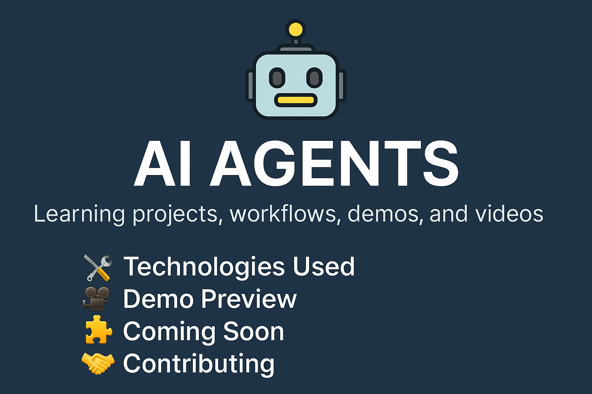

# 🤖 AI Agents

Welcome to **AI Agents** — a curated collection of practical projects, demos, workflows, and videos to **learn and experiment with AI agents**. Whether you're a beginner or an advanced AI enthusiast, this repository is designed to provide hands-on experience in building, running, and understanding AI agent workflows.



## What is This?

This repository includes:
- **Agent Workflows**: End-to-end task pipelines with memory, planning, and tool use.
- **Learning Projects**: Step-by-step guided projects to build and understand different types of agents.
- **Demo Videos**: Recorded sessions showing how each agent behaves and evolves.
- **AI Techniques**: Integration with LLMs, embeddings, vector databases, RAG, tool use, and more.

---

## Repository Structure

```bash
ai-agents/
│
├── basic-agents/             # Minimal agents to get started
├── planning-agents/          # Agents with goal decomposition
├── reactive-agents/          # Agents that respond to environments
├── langchain-agents/         # Agents built with LangChain
├── openai-function-agents/   # OpenAI Function-calling-based agents
├── agent-frameworks/         # Experiments with AutoGen, CrewAI, etc.
├── demos/                    # Screen-recorded videos, GIFs, outputs
├── assets/                   # Images and banners used in README
└── README.md                 # This file
```

---

## 🛠️ Technologies Used

- **Python** 🐍
- **LangChain / AutoGen / CrewAI**
- **OpenAI, Claude, and other LLM APIs**
- **FAISS / ChromaDB** for vector storage
- **Streamlit / Gradio** for UI demos
- **Jupyter Notebooks** for experiments

---

## 📽️ Demo Preview

Full demo videos are available in the [`demos/`](./demos/) folder or [YouTube Playlist](https://www.youtube.com/yourchannel) *(coming soon)*.

---

## 🧩 Coming Soon

- 🔍 **Comparison of agent frameworks** *(AutoGen vs CrewAI vs LangChain)*
- 🗺️ **Agent Memory and Planning techniques**
- 📦 **Docker + FastAPI wrapper** for production deployment
- 📚 **Agent-based learning curriculum**

---

## 🤝 Contributing

If you’d like to contribute:

- Open an issue or a feature request
- Fork and submit a PR with a new agent example or improvement
- Share your demo video for inclusion!

---

## 📜 License

**MIT License** © 2025 [Vibe Coders](https://github.com/vibecoders1)

---

## 🌐 Stay Connected

- 🔗 [Your LinkedIn](https://www.linkedin.com/groups/10087433/)
- 📺 [YouTube Channel](https://www.youtube.com/@vibecoders1)
- 🐦 [Twitter/X](https://twitter.com/vibecoders)


